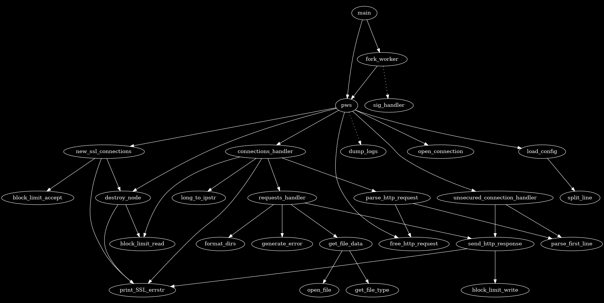

# PWS - a fast, single-threaded, asynchronous, static webserver

why use something fancy like apache or nginx to serve my static files? Thats for losers!!
Nothing says #developer like serving your CV on a webserver you wrote from scratch.

## usage
It is suggested you run this program as root as it needs to bind to port 80 and 443

To start the webserver simply run it
```bash
./pws
```
If you want to run it as a daemon then you can run it with the *--daeomize* flag:
```bash
./pws --daemonize
```
This will print the PID of the daemon.
When running PWS as a daemon, stdout and stderr will be rerouted to pws.log and pws_error.log respectively. These files will be created in the directory the program was started in.


## configure pws
*config.pws* contains the config data for pws. Some fields are required and some fields may be left blank.
### required fields:
- PRIVATE_KEY_FILE
- CERTIFICATE_FILE
- DOMAIN_HOST_NAME
- DOCUMENT_ROOTDIR

### optional fields (can be left blank):
- C_FULLCHAIN_FILE


## dependencies
pws depends on libcrypto, OpenSSL and zlib. These are most likely already on your system, but in the case they aren't, you can install them with:
```bash
sudo apt install openssl zlib1g
```
If you are compiling pws from source you will instead need to install the development libraries:
```bash
sudo apt install libssl-dev zlib1g-dev
```
They will most likely be called the same or similar things on other package managers.

I have not tested which versions are compatible, but I would guess that any recent (last 5 years) release will probably do. On my development machine I am running zlib 1.2.13 and OpenSSL 3.0.17

## build instructions
to compile pws, simply clone the repo and in the root directory run:
```
make
```
et-voila.

## call graph
